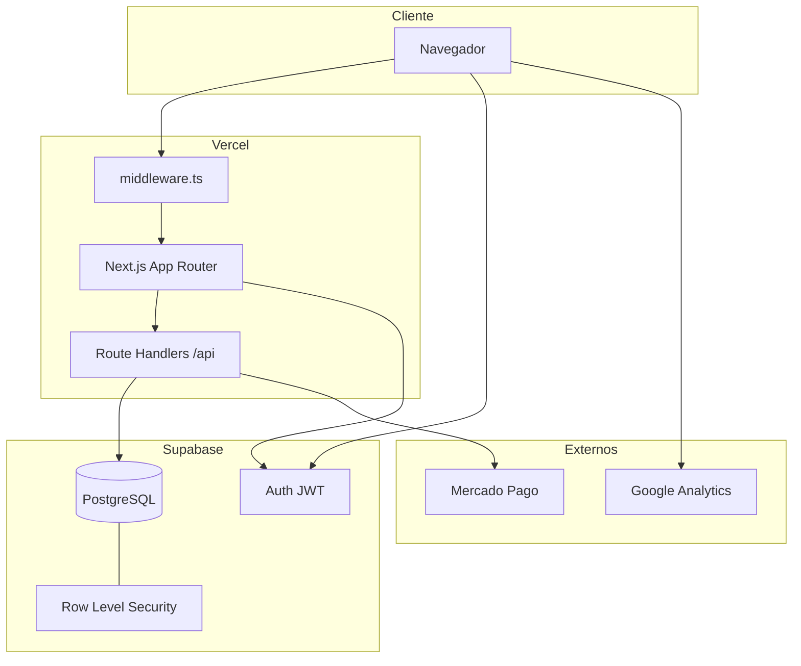
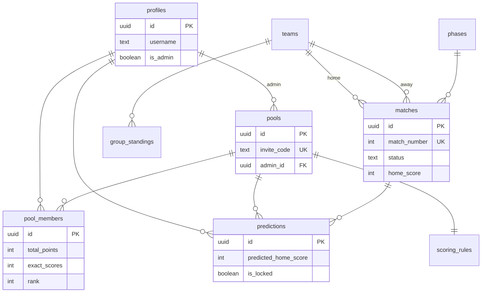
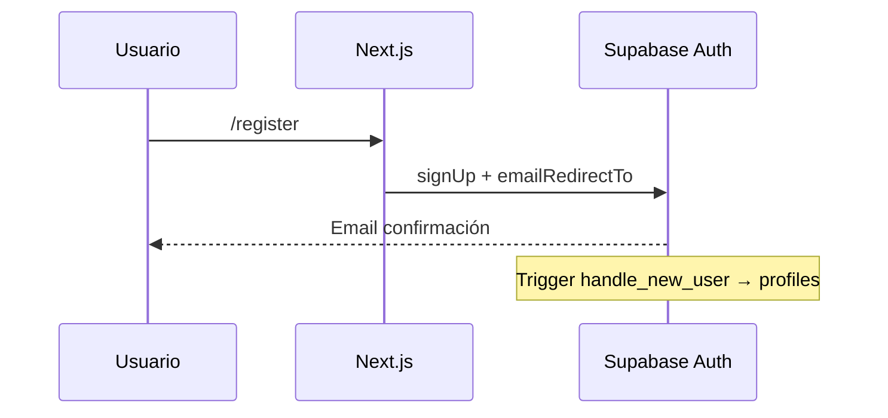

# Documentación técnica — Chocogol (Polla Mundialista FIFA 2026)

**Versión del documento:** 2026-05  
**Repositorio:** `polla-mundial-2026`  
**Producción:** https://www.chocogol.site  

---

## Tabla de contenidos

1. [Resumen del producto](#1-resumen-del-producto)
2. [Stack tecnológico](#2-stack-tecnológico)
3. [Arquitectura](#3-arquitectura)
4. [Infraestructura y despliegue](#4-infraestructura-y-despliegue)
5. [Variables de entorno](#5-variables-de-entorno)
6. [Base de datos (Supabase / PostgreSQL)](#6-base-de-datos-supabase--postgresql)
7. [Seguridad y RLS](#7-seguridad-y-rls)
8. [Reglas de negocio](#8-reglas-de-negocio)
9. [API Routes](#9-api-routes)
10. [Estructura del código](#10-estructura-del-código)
11. [Flujos principales](#11-flujos-principales)
12. [Scripts y mantenimiento](#12-scripts-y-mantenimiento)
13. [SQL de producción](#13-sql-de-producción)
14. [Limitaciones conocidas](#14-limitaciones-conocidas)
15. [Glosario](#15-glosario)

---

## 1. Resumen del producto

Aplicación web para **pollas privadas** del Mundial FIFA 2026 (48 equipos, 104 partidos):

- Cada usuario crea o se une a **pollas** con código de invitación.
- Pronostica marcadores de todos los partidos + **cuadro de honor** (campeón, goleador, etc.).
- La **tabla de la polla** suma puntos según reglas configurables por polla.
- Un **administrador del torneo** carga resultados oficiales; la app recalcula puntos y avanza el cuadro eliminatorio real.
- **Donaciones** voluntarias vía Mercado Pago (COP).
- **Proyección personal:** según los pronósticos del usuario, simula tablas de grupos y cruces KO (sin modificar el calendario oficial).

---

## 2. Stack tecnológico

| Capa | Tecnología |
|------|------------|
| Framework | **Next.js 14** (App Router, React 18) |
| Lenguaje | **TypeScript 5** |
| Estilos | **Tailwind CSS 3**, componentes **shadcn/ui** + Radix |
| Base de datos | **Supabase** (PostgreSQL + Auth + RLS) |
| Hosting | **Vercel** |
| Pagos | **Mercado Pago** Checkout Pro (`mercadopago` SDK) |
| Dominio | **Hostinger** (DNS) → Vercel |
| Analytics | **Google Analytics 4** (`G-QWWJQLSD0T`) |
| Banderas | `flag-icons` → `public/flags` + `/api/flag/[code]` |

---

## 3. Arquitectura



### Capas lógicas

| Capa | Ubicación | Responsabilidad |
|------|-----------|---------------|
| UI | `app/`, `components/` | Páginas y componentes React |
| Server | Server Components, `app/api/*` | Datos iniciales, APIs, service role |
| Dominio | `lib/` | Puntuación, bracket, standings, invitaciones |
| Datos | `supabase/` | Esquema, migraciones, parches SQL |
| Seed | `scripts/wc2026-data.ts`, `scripts/seed.ts` | Calendario FIFA 2026 |

### Dos pipelines de torneo

| Pipeline | Fuente de verdad | Efecto en BD |
|----------|------------------|--------------|
| **Oficial** | Admin guarda resultados en `matches` | `group_standings`, equipos en KO, puntos reales |
| **Proyección** | Pronósticos del usuario en `predictions` | Solo lectura en UI/API; no escribe `matches` |

---

## 4. Infraestructura y despliegue

### Producción

| Servicio | Rol |
|----------|-----|
| **Vercel** | Build (`npm run build`), SSR/ISR, APIs, env vars |
| **Supabase** | Proyecto único (URL en `NEXT_PUBLIC_SUPABASE_URL`) |
| **Hostinger** | DNS del dominio |
| **Mercado Pago** | Cobro donaciones |

### DNS (dominio raíz + www)

Registros recomendados en Hostinger:

| Tipo | Host | Valor |
|------|------|--------|
| A | `@` | IP que indique Vercel (ej. `216.198.79.1`) |
| CNAME | `www` | Host que indique Vercel (ej. `*.vercel-dns-*.com`) |

En Vercel → **Domains**: `chocogol.site` redirige a `www.chocogol.site`.

### Build en Vercel

```bash
node scripts/copy-flags.mjs && next build
```

- `postinstall` también copia banderas desde `node_modules/flag-icons`.
- `scripts/` excluido del typecheck de producción vía `tsconfig.json`.

### Despliegue

1. Push a `main` → deploy automático en Vercel.
2. Variables de entorno en **Production** (ver sección 5).
3. Tras cambios de esquema: ejecutar SQL en Supabase (sección 13).

---

## 5. Variables de entorno

Archivo plantilla: `.env.example`. **Nunca** subir `.env.local` a Git.

| Variable | Obligatoria prod | Descripción |
|----------|------------------|-------------|
| `NEXT_PUBLIC_SUPABASE_URL` | Sí | URL del proyecto Supabase |
| `NEXT_PUBLIC_SUPABASE_ANON_KEY` | Sí | Clave anónima (cliente + RLS) |
| `SUPABASE_SERVICE_ROLE_KEY` | Sí | Bypass RLS en APIs servidor; leaderboard, admin |
| `NEXT_PUBLIC_APP_URL` | Sí | `https://www.chocogol.site` — MP, emails, SEO |
| `MP_ACCESS_TOKEN` | Sí (donaciones) | Token producción `APP_USR-` o prueba `TEST-` |
| `TOURNAMENT_ADMIN_EMAILS` | Recomendada | Emails admin torneo (respaldo) |
| `NEXT_PUBLIC_GA_MEASUREMENT_ID` | Opcional | GA4 (default en código: `G-QWWJQLSD0T`) |
| `MP_PUBLIC_KEY`, `MP_CLIENT_ID`, `MP_CLIENT_SECRET` | No usadas | Reservadas |
| `PREMIUM_PRICE_COP` | Opcional | Premium futuro |
| `FOOTBALL_DATA_API_KEY` | No usada aún | API externa |
| `CRON_SECRET` | Opcional | Cron futuro |
| `ADMIN_SECRET_KEY` | Opcional | Protección extra |

Ver también: [DOMINIO-Y-EMAILS.md](./DOMINIO-Y-EMAILS.md), [MERCADOPAGO.md](./MERCADOPAGO.md).

---

## 6. Base de datos (Supabase / PostgreSQL)

Esquema canónico: `supabase/schema.sql`. Migraciones incrementales en `supabase/migrations/`.

### Diagrama entidad-relación (simplificado)



### Tablas principales

| Tabla | Descripción |
|-------|-------------|
| `profiles` | Perfil por usuario Auth (`id` = `auth.users.id`) |
| `teams` | 48 selecciones, `group_letter`, `code` (bandera) |
| `phases` | Fases: `groups`, `round_of_32`, `round_of_16`, … |
| `matches` | 104 partidos; `match_number` 1–72 grupos, 73–104 KO |
| `group_standings` | Tabla oficial por equipo (global, no por polla) |
| `pools` | Polla privada + `invite_code` |
| `pool_members` | Miembros + acumulados y `rank` |
| `predictions` | Pronóstico por usuario/polla/partido |
| `honor_predictions` | Cuadro de honor por usuario/polla |
| `honor_results` | Ganadores oficiales (admin) |
| `scoring_rules` | Puntos por polla (1 fila por polla) |
| `donations` | Donaciones MP |
| `result_audit_log` | Auditoría cambios de resultado (sin lectura cliente) |

### Partidos

- **Grupos:** `match_number` 1–72, `group_letter` A–L, 4 equipos × 6 partidos por grupo.
- **Eliminatoria:** 73–88 dieciseisavos, 89–96 octavos, 97–100 cuartos, 101–102 semifinales, 103 tercer puesto, 104 final.
- `elimination_slot_label`: texto del cruce FIFA (ej. "2º Grupo A vs 2º Grupo B").
- `status`: `scheduled` | `finished` (y variantes según uso).
- Penales: `home_penalties`, `away_penalties` en KO.

Datos seed: `scripts/wc2026-data.ts` → `npm run seed`.

### Funciones SQL (RPC)

| Función | Uso |
|---------|-----|
| `add_points_to_member` | Incrementa puntos/exactos/resultados en `pool_members` |
| `recalculate_pool_rankings` | Ordena por `total_points`, `exact_scores`; asigna `rank` |
| `handle_new_user` | Trigger: crea `profiles` al registrarse |
| `user_in_pool` | RLS: evita recursión en políticas |
| `users_share_pool` | RLS: perfiles visibles entre copañeros de polla |
| `pool_by_invite_code` | Buscar polla por código sin listar todas |
| `list_pool_members` | Leaderboard con nombres (SECURITY DEFINER) |
| `join_pool` | Unirse a polla con validación |
| `ensure_my_profile` | Crear perfil si falta |
| `grant_tournament_admin` | Otorgar admin por email |
| `am_i_tournament_admin` | Comprobar admin torneo |
| `tournament_predictions_window_open` | `true` hasta 5 min antes del partido #1 |

### Desempate en tabla de polla

`recalculate_pool_rankings` ordena:

1. `total_points` DESC  
2. `exact_scores` DESC  
3. `user_id` ASC (desempate técnico determinista)

---

## 7. Seguridad y RLS

### Autenticación

- **Supabase Auth** (email/password).
- `middleware.ts`: refresca sesión en cookies; protege `/admin/*`.
- Admin torneo: `profiles.is_admin`, JWT `app_metadata`, RPC `am_i_tournament_admin`, o `TOURNAMENT_ADMIN_EMAILS`.

### Row Level Security (RLS)

Activado en tablas sensibles. Resumen:

| Recurso | Lectura | Escritura |
|---------|---------|-----------|
| `teams`, `matches`, `phases`, `group_standings` | Pública | Solo service role / admin |
| `pools` | Miembros, admin, públicas | Admin crea/actualiza |
| `predictions` | Propias + miembros misma polla | Propias si ventana abierta y no `is_locked` |
| `honor_predictions` | Propias + miembros | Propias si ventana abierta |
| `donations` | Bloqueado cliente | Insert vía API (service role) |

### Service role (`SUPABASE_SERVICE_ROLE_KEY`)

Usado en servidor para:

- Leaderboard cuando RLS falla en producción.
- APIs admin (resultados, honor, sync bracket).
- Webhook Mercado Pago.
- Unirse a polla / listar miembros (fallback).

**Nunca** exponer service role al cliente.

### Cierre global de pronósticos

RLS + `tournament_predictions_window_open()`: insert/update en `predictions` y `honor_predictions` solo antes del pitazo inaugural − 5 minutos.

SQL: `supabase/TOURNAMENT_LOCK.sql`.

---

## 8. Reglas de negocio

### Puntuación por partido (`lib/scoring.ts`)

Por cada pronóstico vs resultado oficial:

| Caso | Puntos (default) |
|------|----------------|
| Marcador exacto | 5 (`exact_score_points`) |
| Solo 1-X-2 correcto | 2 (`correct_result_points`) |
| Fallo | 0 |

No se suman ambos: exacto no duplica bonus de resultado.

Recálculo: `lib/recalculate-match-points.ts` → RPC `add_points_to_member`.

### Cuadro de honor (`lib/honor-points.ts`)

Puntos al cerrar honor oficial (admin). Comparación de nombres de jugadores flexible (`honorNamesMatch`).

### Tabla de grupos oficial

`lib/rebuild-standings.ts`: reconstruye `group_standings` desde partidos `finished` de fase grupos. Criterios: puntos → diferencia de goles → goles a favor.

### Eliminatoria oficial (`lib/bracket/wc2026-knockout.ts`)

1. Cuando todos los partidos de grupos están `finished`:
2. `fillRoundOf32FromGroupStandings`: 1º/2º por grupo + **8 mejores terceros** vía matriz FIFA (`lib/data/wc2026-r32-third-matrix.json`, 495 combinaciones).
3. `propagateKnockoutFromResults`: octavos → final según ganadores (penales en empates).

Disparado en `POST /api/admin/results` y manualmente `POST /api/admin/sync-bracket`.

### Proyección por pronósticos (`lib/bracket/predicted-projection.ts`)

- Calcula standings desde pronósticos de grupos del usuario.
- Misma matriz de terceros y plantilla R32 que el oficial.
- Propaga KO con marcadores pronosticados; **empate en KO no avanza** (sin penales en proyección).
- API: `GET /api/pool/[id]/projection`.
- UI: `components/pool/predicted-projection-panel.tsx`.

### Invitaciones

- Código 6 caracteres: `lib/invite-code.ts`.
- Unión: `join_pool` RPC o `lib/join-pool.ts`.
- Preview polla por código: `pool_by_invite_code` (no enumera pollas).

---

## 9. API Routes

Todas bajo `app/api/`. `dynamic = force-dynamic` donde aplica.

### Públicas / autenticadas

| Método | Ruta | Auth | Descripción |
|--------|------|------|-------------|
| GET | `/api/tournament/lock-status` | No | Estado ventana pronósticos |
| GET | `/api/flag/[code]` | No | SVG bandera |
| GET | `/api/me` | Sesión | Perfil + `isAdmin` |
| GET | `/api/pool/[id]/leaderboard` | Miembro | Tabla polla (service role fallback) |
| GET | `/api/pool/[id]/projection` | Miembro | Proyección grupos/KO usuario |
| POST | `/api/payments/donation` | No | Crear preferencia MP |
| POST | `/api/payments/webhook-donation` | MP | Webhook pago |

### Admin torneo

| Método | Ruta | Descripción |
|--------|------|-------------|
| POST | `/api/admin/results` | Guardar resultado partido |
| POST | `/api/admin/reset-match` | Revertir partido |
| POST | `/api/admin/sync-bracket` | Sincronizar cruces FIFA |
| POST | `/api/admin/honor-results` | Cuadro honor oficial |

Protección: `lib/auth-admin.ts` → `requireAdmin()`.

---

## 10. Estructura del código

```
polla-mundial-2026/
├── app/                    # Next.js App Router
│   ├── page.tsx            # Home + Hero
│   ├── layout.tsx          # Root layout, GA, Toaster
│   ├── dashboard/          # Mis pollas
│   ├── pool/
│   │   ├── create/         # Crear polla
│   │   ├── join/           # Unirse por código
│   │   └── [id]/           # Detalle, predict, honor, transparency, settings
│   ├── fixture/            # Calendario + tablas oficiales
│   ├── donate/             # Donaciones
│   ├── admin/              # Panel torneo
│   ├── login|register|...  # Auth
│   └── api/                # Route handlers
├── components/
│   ├── pool/               # Leaderboard, proyección, scoring blurb
│   ├── tournament/         # MatchCard, GroupStandingsTable, flags
│   ├── landing/            # Hero, guía
│   └── ui/                 # shadcn
├── lib/
│   ├── supabase/           # client, server, service, middleware helpers
│   ├── bracket/            # wc2026-knockout, predicted-projection
│   ├── scoring.ts, honor-points.ts, rebuild-standings.ts
│   ├── pool-leaderboard.ts, tournament-lock.ts, copy.ts
│   └── data/wc2026-r32-third-matrix.json
├── supabase/
│   ├── schema.sql          # Esquema completo
│   ├── migrations/         # Migraciones ordenadas
│   └── *.sql               # Parches manuales producción
├── scripts/
│   ├── seed.ts             # Carga BD inicial
│   ├── wc2026-data.ts      # 48 equipos + 104 partidos
│   └── set-admin.ts, reset-password.ts, ...
├── public/flags/           # Banderas generadas en build
├── docs/                   # Esta documentación
└── middleware.ts           # Sesión + guard /admin
```

### Páginas clave

| Ruta | Tipo | Descripción |
|------|------|-------------|
| `/` | Estática/SSR | Landing |
| `/dashboard` | Dinámica | Listado pollas del usuario |
| `/pool/[id]` | Dinámica | Tabla + enlaces |
| `/pool/[id]/predict` | Cliente | Pronósticos + proyección |
| `/pool/[id]/honor` | Cliente | Cuadro honor |
| `/pool/[id]/transparency` | Cliente | Ver pronósticos del grupo |
| `/fixture` | Dinámica | Partidos y standings oficiales |
| `/admin/results` | Cliente | Cargar marcadores |
| `/donate` | Cliente | Donación MP |

### Cliente Supabase

| Archivo | Uso |
|---------|-----|
| `lib/supabase/client.ts` | Componentes `"use client"` |
| `lib/supabase/server.ts` | Server Components y Route Handlers |
| `lib/supabase/service.ts` | `createServiceClient()` — solo servidor |

---

## 11. Flujos principales

### Registro y login



### Crear polla y unirse

1. Usuario autenticado → `/pool/create` → server action inserta `pools` + `scoring_rules` + `pool_members` (admin).
2. Comparte `invite_code` o link `/pool/join/CODIGO`.
3. Otro usuario → `join_pool` → fila en `pool_members`.

### Guardar pronóstico

1. Cliente upsert en `predictions` (RLS + ventana temporal).
2. Al cerrar partido (admin), `is_locked = true` en pronósticos de ese partido.
3. `recalculatePointsForMatch` actualiza `points_earned` y totales en `pool_members`.

### Admin guarda resultado

1. `POST /api/admin/results` con `matchId`, marcadores, penales opcionales.
2. Update `matches` → `status = finished`.
3. Si fase grupos → `rebuildGroupStandings`.
4. `recalculatePointsForMatch` para todas las pollas.
5. `tryAdvanceWorldCupBracket` → R32 + propagación KO.

### Donación

Ver [MERCADOPAGO.md](./MERCADOPAGO.md).

---

## 12. Scripts y mantenimiento

| Comando | Script | Descripción |
|---------|--------|-------------|
| `npm run dev` | — | Desarrollo local :3000 |
| `npm run build` | copy-flags + next build | Producción |
| `npm run seed` | `scripts/seed.ts` | Equipos, fases, 104 partidos (service role) |
| `npm run set-admin -- email` | `scripts/set-admin.ts` | Marcar admin torneo |
| `npm run reset-password -- email pass` | `scripts/reset-password.ts` | Reset clave Auth |
| `npm run check-env` | `scripts/check-env-project.mjs` | Validar .env |
| `npm run parse-third-matrix` | `scripts/parse-wiki-third-place-table.mjs` | Regenerar JSON matriz 495 |

---

## 13. SQL de producción

Ejecutar en **Supabase → SQL Editor** cuando el entorno no aplica migraciones automáticas.

| Archivo | Cuándo |
|---------|--------|
| `schema.sql` | Proyecto nuevo desde cero |
| `FIX_PRODUCTION.sql` | RLS/perfiles base |
| `FIX_POOL_MEMBERS_PRODUCTION.sql` | `list_pool_members`, `join_pool` |
| `FIX_MATCHES_COLUMNS.sql` | Columna `updated_by` en matches |
| `APPLY_ADMIN.sql` | Admin, RPCs perfil |
| `SET_JWT_ADMIN.sql` | JWT metadata admin |
| `TOURNAMENT_LOCK.sql` | Cierre pronósticos pre-inaugural |
| `TIEBREAK_EXACT.sql` | Desempate por exactos |
| `FIX_ADMIN_VISIBILITY.sql` | Visibilidad admin |

Orden sugerido en instalación nueva: `schema.sql` → migraciones por fecha → parches según síntomas.

---

## 14. Limitaciones conocidas

| Tema | Detalle |
|------|---------|
| Tie-break FIFA completo | No hay fair play ni enfrentamiento directo entre 3; solo pts/GD/GF |
| Proyección KO | Empates pronosticados no definen ganador; no hay penales en proyección |
| `group_standings` | Global del torneo, no por polla |
| Premium polla | Campos `is_premium` existen; flujo MP premium no completo en UI |
| Webhook MP | Sin validación firma `x-signature` (mejora pendiente) |
| Escala | Recálculo por partido en todas las pollas puede tardar con muchos usuarios |
| Un solo Supabase | Local y prod deben usar el **mismo** proyecto o datos divergen |

---

## 15. Glosario

| Término | Significado |
|---------|-------------|
| **Polla** | Grupo privado de competencia entre amigos |
| **Pool** | Mismo que polla (nombre en código) |
| **Honor** | Pronósticos especiales: campeón, goleador, etc. |
| **RLS** | Row Level Security de PostgreSQL |
| **R32** | Dieciseisavos de final (partidos 73–88) |
| **Matriz 495** | Combinaciones FIFA para ubicar 8 mejores terceros en R32 |
| **Service role** | Clave Supabase con privilegios totales (solo servidor) |
| **Ventana de pronósticos** | Tiempo hasta 5 min antes del partido inaugural |

---

## Contacto y mantenimiento del documento

Actualizar este archivo cuando:

- Se añadan tablas, APIs o flujos nuevos.
- Cambien reglas FIFA o cantidad de partidos.
- Se modifique infraestructura (dominio, env vars críticas).

**Archivos relacionados:** `docs/README.md`, `.env.example`, `supabase/schema.sql`.
